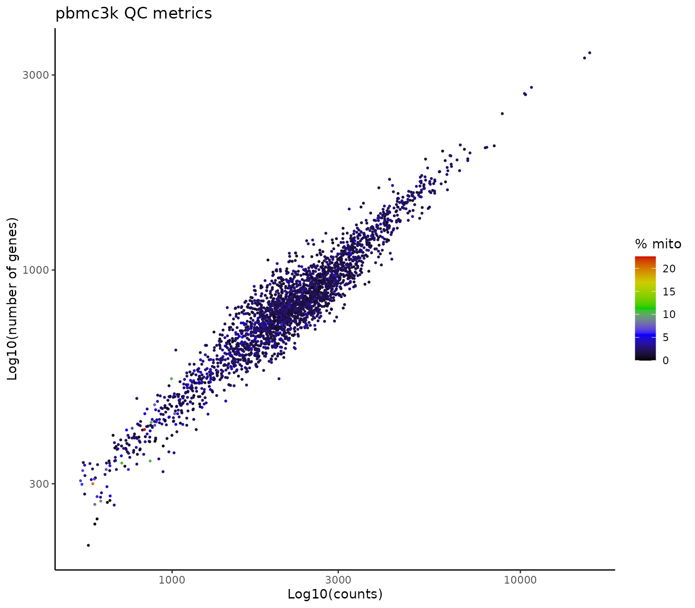
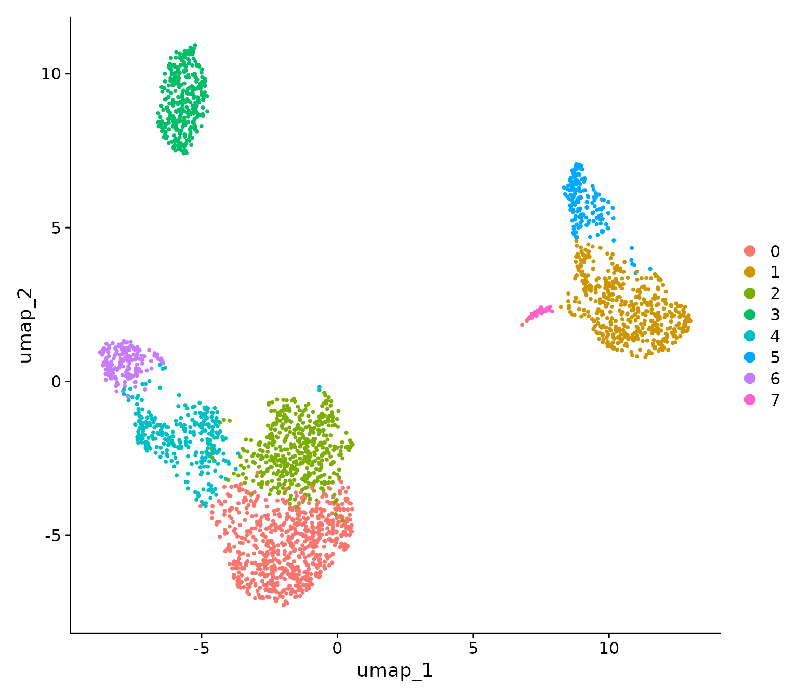
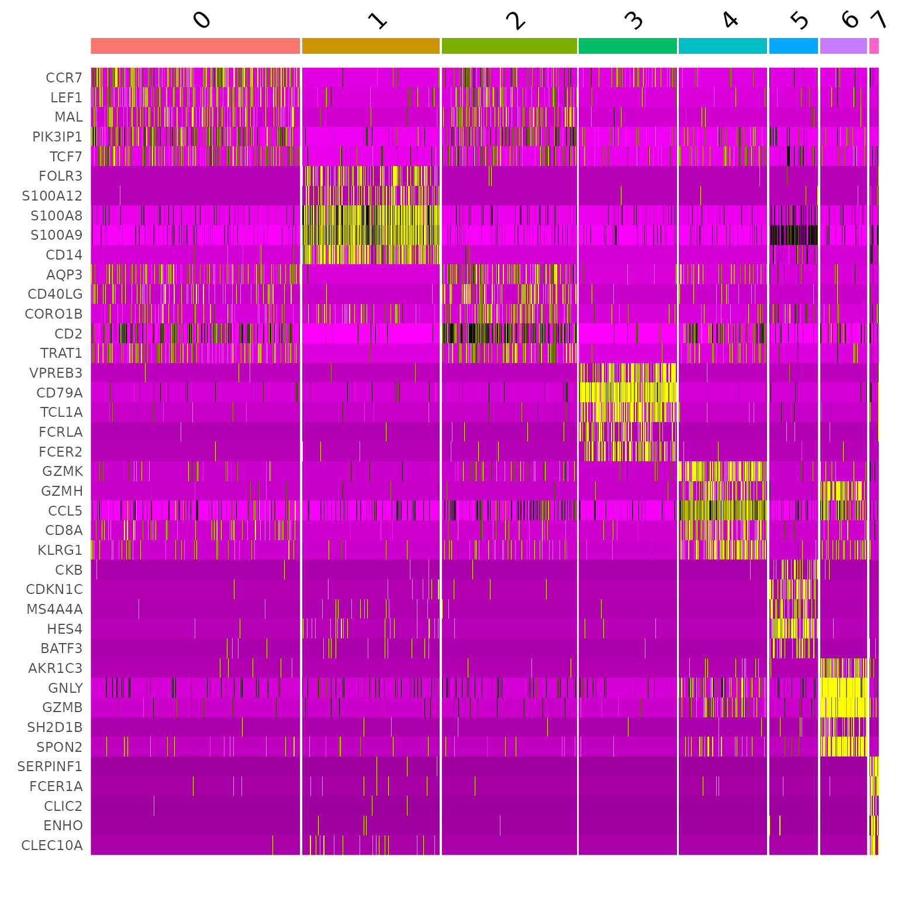
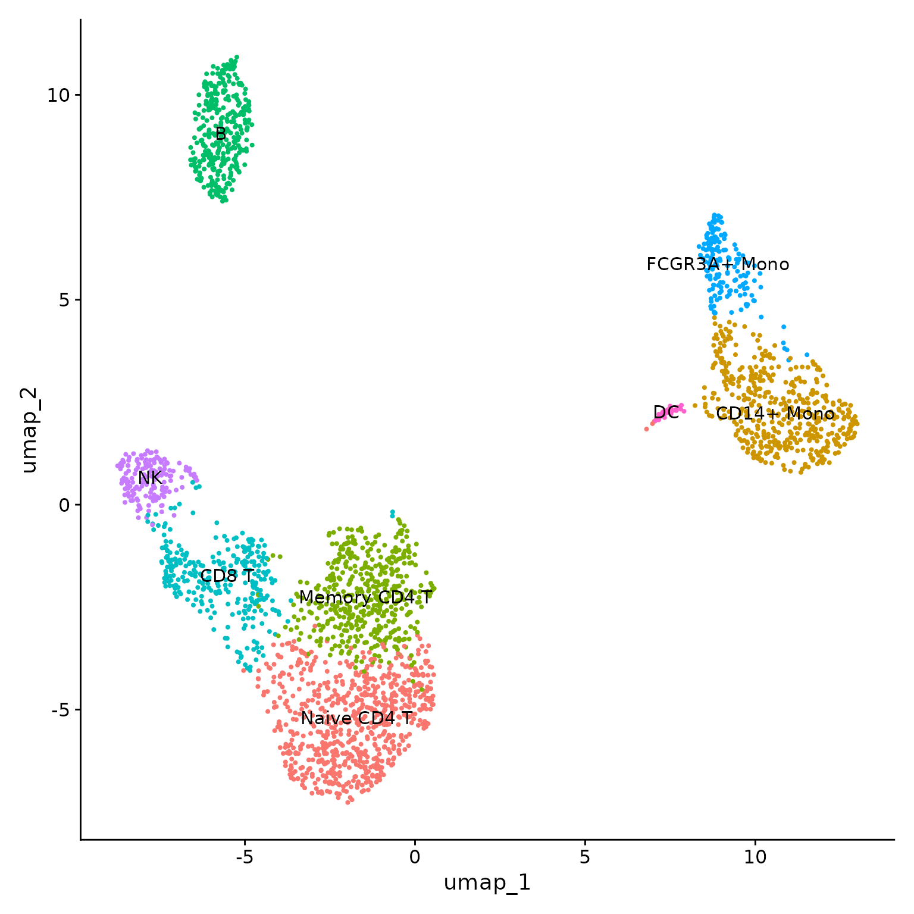
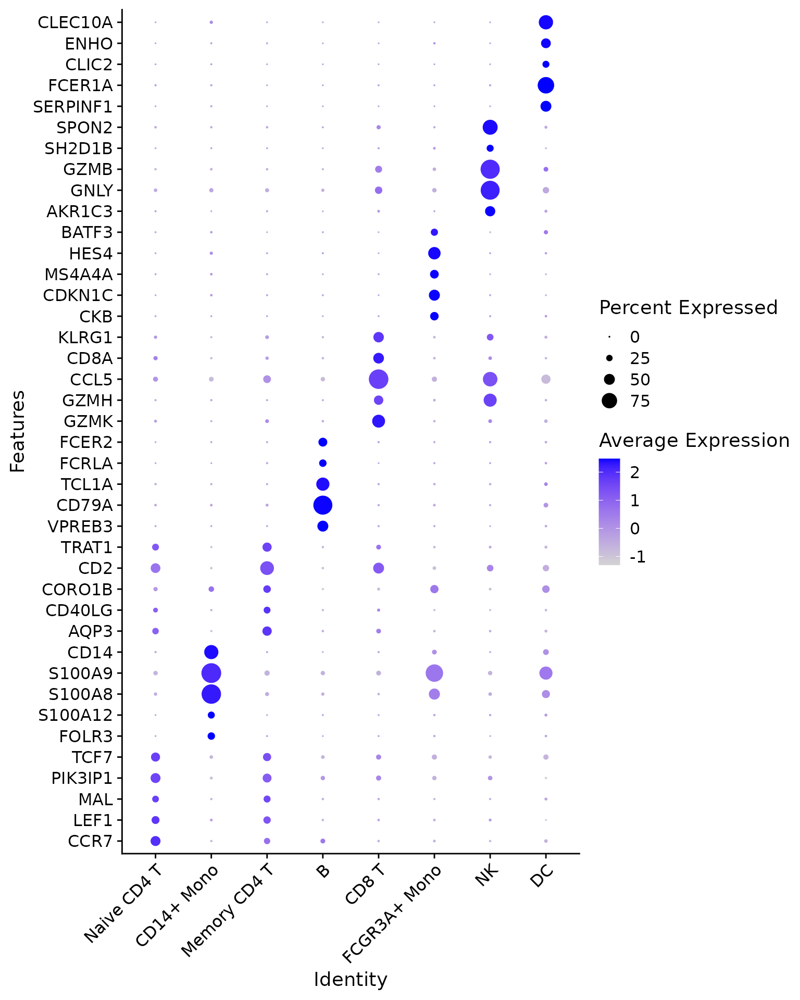
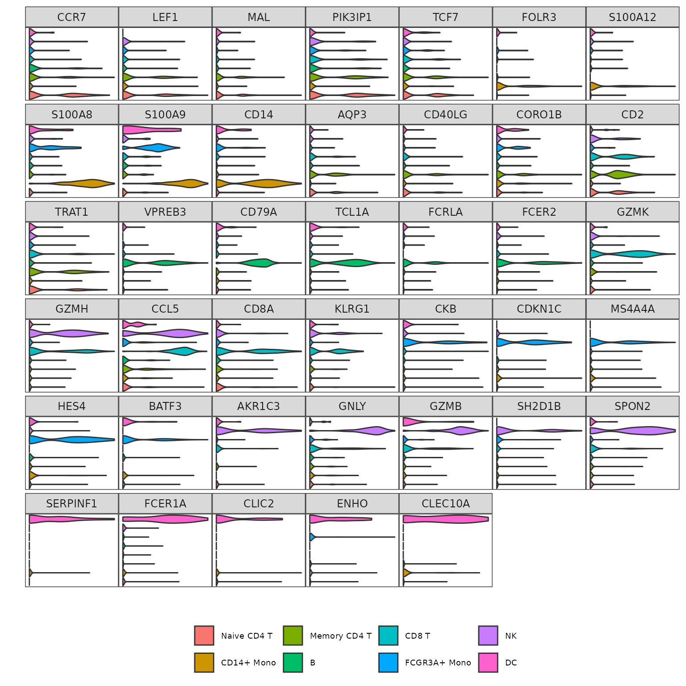

# Getting Started with RightOmicsTools

## Introduction

This tutorial will guide you through the main functions of the
`RightOmicsTools` package, designed to provide complementary tools to
the analysis of single-cell RNA-seq data, such as plotting, data
manipulation, and more. The package is still under development, and new
functions will be added in the future.

## Installation

If you are using Windows, you first need to make sure you have Rtools
installed, as some dependencies needed for `RightOmicsTools` require
compilation. You may download Rtools from
[here](https://cran.r-project.org/bin/windows/Rtools/).

You may install the package from GitHub using the `devtools` package,
which, if you don’t have it, may be installed using the following
command:

``` r
install.packages("devtools")
```

Once installed, you may install `RightOmicsTools` using the following
command:

``` r
devtools::install_github("Alexis-Varin/RightOmicsTools")
```

## Data loading

For this tutorial, we will use the `pbmc3k` dataset, which contains
single-cell RNA-seq data from peripheral blood mononuclear cells
(PBMCs), and made available by [10X
Genomics](https://www.10xgenomics.com/datasets/3-k-pbm-cs-from-a-healthy-donor-1-standard-1-1-0).

We will also build on the `Seurat` package’s `pbmc3k` tutorial to
preprocess it, available for reference
[here](https://satijalab.org/seurat/articles/pbmc3k_tutorial).

Let’s start by loading all the packages we will be using in this
vignette:

``` r
library(RightOmicsTools)
library(Seurat)
library(ggplot2)
```

Next, we will load the `pbmc3k` dataset using our first function from
`RightOmicsTools`,
[Right_Data](https://alexis-varin.github.io/RightOmicsTools/reference/Right_Data.html),
which handles all data preparation for us, and check its contents:

``` r
# Checking available datasets
Right_Data(list.datasets = TRUE)

# Loading the data
pbmc3k <- Right_Data("pbmc3k")

# Checking the contents of the object
pbmc3k
colnames(pbmc3k@meta.data)
```

    #> Available datasets:
    #> "pbmc3k"   a Seurat v4 object of 2,700 cells by 13,714 genes
    #>            PBMCs of a healthy donor from 10XGenomics
    #> 
    #> "monolps"   a Seurat v5 object of 3,693 cells by 23,798 genes
    #>             Monocytes stimulated or not with LPS from GSE226488

    #> An object of class Seurat 
    #> 13714 features across 2700 samples within 1 assay 
    #> Active assay: RNA (13714 features, 2000 variable features)
    #>  2 layers present: counts, data
    #>  1 dimensional reduction calculated: umap

    #> [1] "orig.ident"         "nCount_RNA"         "nFeature_RNA"      
    #> [4] "seurat_annotations" "treatment"

Since the object seems to contain a ‘data’ layer, a UMAP reduction and
annotations, and we are unsure to what extent is has been preprocessed
and processed, we will also test another function from
`RightOmicsTools`,
[Right_DietSeurat](https://alexis-varin.github.io/RightOmicsTools/reference/Right_DietSeurat.html),
which is a reworked version of
[DietSeurat](https://satijalab.org/seurat/reference/dietseurat), and
will remove all the layers and slots from the object, leaving only the
counts layer from the RNA assay. We will also remove all meta.data
columns except for the ‘orig.ident’ metadata to truly start anew.
[Right_DietSeurat](https://alexis-varin.github.io/RightOmicsTools/reference/Right_DietSeurat.html)
is highly customizable, check the documentation for more information:

``` r
# Reducing the object to the counts layer and the 'orig.ident' metadata
pbmc3k <- Right_DietSeurat(pbmc3k, idents = "orig.ident")

# Checking the contents of the object
pbmc3k
colnames(pbmc3k@meta.data)
```

    #> An object of class Seurat 
    #> 13714 features across 2700 samples within 1 assay 
    #> Active assay: RNA (13714 features, 0 variable features)
    #>  1 layer present: counts

    #> [1] "orig.ident"   "nCount_RNA"   "nFeature_RNA"

## Data preprocessing

### Quality control and cell filtering

We will now move on to preprocessing. We start by calculating the
percentage of mitochondrial genes and plot these results alongside the
number of genes (nFeature_RNA) and counts (nCount_RNA) per cell:

``` r
# Calculate percentage of mitochondrial genes
pbmc3k[["percent.mt"]] <- PercentageFeatureSet(pbmc3k, pattern = "^MT-")

# Plot QC
ggplot(pbmc3k@meta.data, aes(x = nCount_RNA, y = nFeature_RNA, col = percent.mt)) + 
  geom_point(size=0.5) + 
  scale_color_gradientn(colors=c("black","blue","green3","yellow3","red3")) +
  ggtitle("pbmc3k QC metrics") +
  labs(x = "Log10(counts)", y = "Log10(number of genes)", col = "% mito") +
  scale_y_log10() +
  scale_x_log10() +
  theme_bw() +
  theme(panel.border = element_blank(),
        panel.grid.major = element_blank(),
        panel.grid.minor = element_blank(),
        axis.line = element_line(colour = "black"))
```



Based on the plot above, we will filter out cells with more than 10%
mitochondrial genes as well as cells with less than 400 or more than
2500 genes:

``` r
# Filter cells
pbmc3k <- subset(pbmc3k, subset = nFeature_RNA > 400 &
                              nFeature_RNA < 2500 &
                              percent.mt < 10)

# Checking the contents of the object
pbmc3k
```

    #> An object of class Seurat 
    #> 13714 features across 2595 samples within 1 assay 
    #> Active assay: RNA (13714 features, 0 variable features)
    #>  1 layer present: counts

### Normalization

Now that we have filtered the cells, we will move on to the next step,
which is normalizing, scaling the data and identifying highly variable
genes. For convenience, we use the same parameters as in the `Seurat`
package tutorial:

``` r
# Normalizing the data with default parameters
pbmc3k <- NormalizeData(pbmc3k)

# Find highly variable genes with default parameters
pbmc3k <- FindVariableFeatures(pbmc3k)

# Scaling all genes, by default it only scales the variable features
pbmc3k <- ScaleData(pbmc3k, features = rownames(pbmc3k))
```

### Dimensionality reduction

Next, we will perform dimensionality reduction and unsupervised
clustering. We again use the same parameters as in the `Seurat` package
tutorial:

``` r
# Perform PCA
pbmc3k <- RunPCA(pbmc3k)

# Clustering
pbmc3k <- FindNeighbors(pbmc3k, dims = 1:10)
pbmc3k <- FindClusters(pbmc3k, resolution = 0.5)

# UMAP
pbmc3k <- RunUMAP(pbmc3k, dims = 1:10)
```

Finally, we will plot the UMAP, which concludes the preprocessing steps:

``` r
# Plot UMAP
DimPlot(pbmc3k)
```



Interestingly, compared to the `Seurat` package tutorial, we are missing
the platelet cluster, which is likely due to the fact that we have a
more drastic cutoff for the number of genes per cell, at 400 versus 200.
This is a good example of how the preprocessing steps can influence the
clustering results.

## Downstream analysis

### Markers

A growing number of methods exist to label single-cell clusters, from
using reference datasets with `SingleR` package or
[Azimuth](https://azimuth.hubmapconsortium.org/), to querying ChatGPT
with `GPTCelltype` package, via using canonical markers from the
scientific literature. The vast majority of these methods need a set of
genes as input, and determining the most differentially expressed genes
(DEG) in each cluster is a common first step.

For this purpose, we are going to use a function from `RightOmicsTools`,
[Find_Annotation_Markers](https://alexis-varin.github.io/RightOmicsTools/reference/Find_Annotation_Markers.html),
which is a wrapper function around
[FindMarkers](https://satijalab.org/seurat/reference/findmarkers). It is
designed by default to conveniently output a character vector of the top
5 markers, chosen based on the highest average log fold change in genes
expressed in at least 25% of cells in each cluster, and with
mitochondrial, ribosomal and non-coding genes excluded, in order to
maximize the chances of finding canonical markers in an unsupervised
manner. It also provides many more parameters which can be used to
tailor the function to your specific needs:

``` r
# Top 5 markers for each cluster, we will name each marker with cluster identity
annotation.markers <- Find_Annotation_Markers(pbmc3k,
                                              name.features = TRUE)

# Display markers for each cluster
annotation.markers
```

    #> Finding markers for cluster 0 against all other clusters
    #> Finding markers for cluster 1 against all other clusters
    #> Finding markers for cluster 2 against all other clusters
    #> Finding markers for cluster 3 against all other clusters
    #> Finding markers for cluster 4 against all other clusters
    #> Finding markers for cluster 5 against all other clusters
    #> Finding markers for cluster 6 against all other clusters
    #> Finding markers for cluster 7 against all other clusters

    #>  [1] "CCR7"     "LEF1"     "MAL"      "PIK3IP1"  "TCF7"     "FOLR3"   
    #>  [7] "S100A12"  "S100A8"   "S100A9"   "CD14"     "AQP3"     "CD40LG"  
    #> [13] "CORO1B"   "CD2"      "TRAT1"    "VPREB3"   "CD79A"    "TCL1A"   
    #> [19] "FCRLA"    "FCER2"    "GZMK"     "GZMH"     "CCL5"     "CD8A"    
    #> [25] "KLRG1"    "CKB"      "CDKN1C"   "MS4A4A"   "HES4"     "BATF3"   
    #> [31] "AKR1C3"   "GNLY"     "GZMB"     "SH2D1B"   "SPON2"    "SERPINF1"
    #> [37] "FCER1A"   "CLIC2"    "ENHO"     "CLEC10A"

These markers may then be directly used for plotting. Since the `Seurat`
package tutorial uses
[DoHeatmap](https://satijalab.org/seurat/reference/doheatmap), we will
compare it to its equivalent in `RightOmicsTools`,
[Cell_Heatmap](https://alexis-varin.github.io/RightOmicsTools/reference/Cell_Heatmap.html),
which is reworked using the `ComplexHeatmap` package instead of the
`ggplot2` package:

``` r
Cell_Heatmap(pbmc3k,
             features = annotation.markers,
             cluster.features = FALSE,
             show.idents.legend = FALSE)
```


Let’s compare it to `Seurat` package’s default heatmap function:

``` r
DoHeatmap(pbmc3k,
          features = annotation.markers) + 
  NoLegend()
```



While both heatmaps look similar aside from colors, which is on purpose
with default parameters,
[Cell_Heatmap](https://alexis-varin.github.io/RightOmicsTools/reference/Cell_Heatmap.html)
truly shines in complexity by offering more customization options, such
as the possibility to cluster features, apply k-means, or split
identities by another metadata…

### Cell annotation

We will now annotate each cluster with its corresponding cell type and
display the UMAP:

``` r
# Annotate clusters
new.cluster.ids <- c("Naive CD4 T", "CD14+ Mono", "Memory CD4 T",
                     "B", "CD8 T", "FCGR3A+ Mono", "NK", "DC")

names(new.cluster.ids) <- levels(pbmc3k)
pbmc3k <- RenameIdents(pbmc3k, new.cluster.ids)

# Add metadata to Seurat object
pbmc3k@meta.data$named_clusters <- pbmc3k@active.ident

# Plot UMAP with cell types
DimPlot(pbmc3k, label = TRUE) +
  NoLegend()
```



### Cell proportion

Following cell annotation, one often want to visualize the proportion of
each cell type. While using
[table](https://www.rdocumentation.org/packages/base/versions/3.6.2/topics/table)
on the identities gives this information, it is often tedious to
organize these data for plotting; `RightOmicsTools` introduces
[Barplot_Cell_Proportion](https://alexis-varin.github.io/RightOmicsTools/reference/Barplot_Cell_Proportion.html),
which automates cell proportion and conveniently displays a bar plot,
with the possibility to group and/or split based on other metadata, and
many other parameters:

``` r
Barplot_Cell_Proportion(pbmc3k)
```


### Other visualizations

We will conclude by showing the last two visualization functions;
[DotPlot_Heatmap](https://alexis-varin.github.io/RightOmicsTools/reference/DotPlot_Heatmap.html),
which is a reworked version of
[DotPlot](https://satijalab.org/seurat/reference/dotplot), also built
from the `ComplexHeatmap` package instead of the `ggplot2` package, and
[Grid_VlnPlot](https://alexis-varin.github.io/RightOmicsTools/reference/Grid_VlnPlot.html),
which is a stacked version of
[VlnPlot](https://satijalab.org/seurat/reference/vlnplot) in a square
grid, both also offering many more options than their `Seurat` package’s
counterparts:

``` r
# We will disable some parameters to be as close as possible from Seurat's DotPlot
# Due to the number of features, we will also lower dots size and flip the axis
DotPlot_Heatmap(pbmc3k,
                features = annotation.markers,
                dots.size = 2,
                cluster.features = FALSE,
                cluster.idents = FALSE,
                rotate.axis = TRUE)
```


Comparing it to `Seurat` package’s default dotplot function:

``` r
# Seurat's DotPlot function doesn't work well with named features, we will remove names
DotPlot(pbmc3k,
        features = unname(annotation.markers)) + 
  RotatedAxis() + 
  coord_flip()
```



And finally, the grid violin plot:

``` r
Grid_VlnPlot(pbmc3k,
             features = annotation.markers)
```



## Going further

### Advanced data visualization

While we have shown the default parameters of most of the functions of
`RightOmicsTools`, there are many more options available in each
function; to explore the use cases of most of these, and to see how far
they can be customized, check the [advanced data visualization
vignette](https://alexis-varin.github.io/RightOmicsTools/articles/Visualization.html).

### Gene signatures from GSEA

Another interesting feature of `RightOmicsTools` is the possibility to
extract genes from pathways in the Gene Set Enrichment Analysis (GSEA)
database to create and visualize signatures. Check the [gene signatures
from GSEA
vignette](https://alexis-varin.github.io/RightOmicsTools/articles/GSEA.html)
to learn more about the various usages of this function.

### Differentially expressed genes in pseudotime analysis

Finally, `RightOmicsTools` provides helper and visualization functions
to greatly speed up and facilitate differential gene expression in
pseudotime analysis with the `tradeSeq` package, with a focus on a
highly customizable heatmap visualization function. Head over to the
[DEG along pseudotime analysis
vignette](https://alexis-varin.github.io/RightOmicsTools/articles/tradeSeq.html)
for an in-depth look at these functions.
